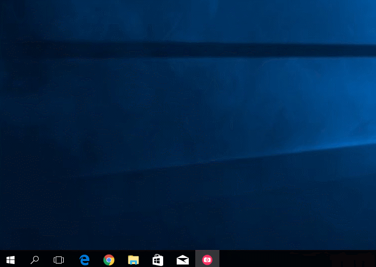

E-Mail
======

For the operation of mail servers we offer a package based on Postfix, Dovecot and SOGo Groupware. Our E-Mail service is 24x7 Monitored by us.

Web interface
-------------

All relevant settings can be made in the Mailcow web interface. The web interface can be found at your ``mail.``-subdomain.

Add new domains
~~~~~~~~~~~~~~~

1. Login to Mailcow under your ``mail.``-subdomain URL
2. Klick on ``Configuration -> Mailboxes``
3. Klick ad ``Add Domain`` and fill in all relevant information.
4. You will need to restart the SOGo service container after adding a new domain. Klick on ``Restart SOGo`` in the upper right corner.

Add new mailboxes
~~~~~~~~~~~~~~~~~

1. Login to Mailcow under your ``mail.``-subdomain URL
2. Klick on ``Configuration -> Mailboxes`` abd then click on "Mailboxes" in the tab
3. Add your new E-Mail adress with the ``Add mailbox``-Button

The settings are applied in real time. Please make sure that the DNS settings are correct.

DNS configuration
-----------------

The following DNS entries are required.

::

    # Name              Type       Value
    mail                IN A       1.2.3.4
    mail                IN AAAA    123:123:123:123
    autodiscover        IN CNAME   mail.example.tld
    autoconfig          IN CNAME   mail.example.tld
    @                   IN MX 10   mail.example.tld

SPF Record
~~~~~~~~~~

Good secured mail services will discard mails sent from hosts which are
not particularly allowed to, eventhough the default behaviour is to
accept every mail. To explicitly allow our mailcow instance to send mails from
your domain you need to add an SPF record to your DNS zone.

::

    @                   IN TXT     "v=spf1 a mx ptr ~all"

warning: Please make sure to include all other servers that should be able to send mails from your domain

DKIM
~~~~

DKIM is an email authentication method designed to detect email spoofing.

::

    dkim._domainkey     IN TXT     "v=DKIM1; k=rsa; t=s; s=email; p=YOURKEY"

DMARC
~~~~~

It allows the owner of a domain to publish a policy on which mechanism (DKIM, SPF or both) is employed and how the receiver should deal with failures.

User `DMARC Record Assistant <http://www.kitterman.com/dmarc/assistant.html>`__ for your correct config.

::

    _dmarc              IN TXT     "v=DMARC1; p=reject; rua=mailto:mailauth-reports@example.org"

Client configuration
--------------------

E-mail clients with autoconfig support find the settings automatically (example: Mozilla Thunderbird).

::

    # Typ     # Server hostname      # Port    # SSL       # Authentication
    IMAP      mail.yourdomain.tld    993       SSL/TLS     Normal password
    POP3      mail.yourdomain.tld    995       SSL/TLS     Normal password
    SMTP      mail.yourdomain.tld    465       SSL/TLS     Normal password

Microsoft Outlook
~~~~~~~~~~~~~~~~~

We support ActiveSync for synchronization of email, calendar and contacts. Please add the e-mail account via "Control Panel > User Accounts and Parental Controls -> E-mail". On this way, the settings are automatically detected by autodiscover.

