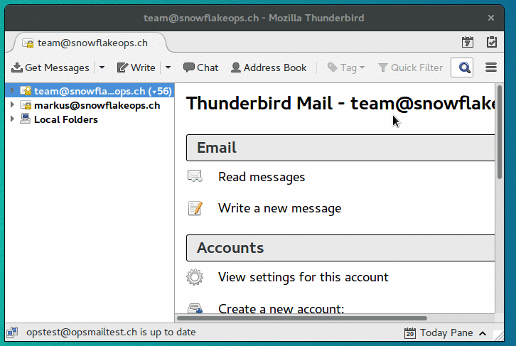

E-Mail
======

For the operation of mail servers we offer a package based on Postfix, Dovecot and SOGo Groupware. Our E-Mail service is 24x7 Monitored by us.

Add a new customer
------------------

Add new domain
~~~~~~~~~~~~~~

All relevant settings can be made in the Mailcow web interface.

1. login as administrator to Mailcow
2. klick on ``Configuration (top right) -> Mailboxes -> Add domain`` and fill in all relevant information
4. restart the SOGo service container after adding a new domain, klick on ``Restart SOGo`` in the upper right corner

.. image:: ../_static/create_domain.gif
   :width: 907px
   :height: 573px
   :scale: 100 %
   :alt: create new domain
   :align: left

Add new mailboxes
~~~~~~~~~~~~~~~~~

1. login as administrator to Mailcow
2. klick on ``Configuration (top right) -> Mailboxes -> Mailboxes (tab) -> Add mailbox`` and fill in all relevant information

.. image:: ../_static/create_mailbox.gif
   :width: 907px
   :height: 573px
   :scale: 100 %
   :alt: create new mailbox
   :align: left

DNS configuration
-----------------

The following DNS entries are required.

::

    # Name              Type       Value
    @                   IN MX 10   mail.yourbrandedmaildomain.tld

- MX Entry: Point the MX-Record of your customer domain to your maildomain. Necessary so that the server can also receive email.

The following DNS entries are highly recommended.

::

    # Name              Type       Value
    @                   IN TXT     "v=spf1 a mx ptr -all"
    autodiscover        IN CNAME   mail.yourbrandedmaildomain.tld
    autoconfig          IN CNAME   mail.yourbrandedmaildomaine.tld

- SPF Entry: Good secured mail services will discard mails sent from hosts which are not particularly allowed to, eventhough the default behaviour is to accept every mail. To explicitly allow our mailserver to send mails from your domain you need to add an SPF record to your DNS zone. warning: Please make sure to include all other servers that should be able to send mails from your domain
- autodiscover/autoconfig: E-Mail clients with autodiscover or autoconfig support will find your settings automatically.

note: für autodiscover und autoconfig musst du die domain ebenfalls im cockpit eintragen, damit es funktioniert.

::

    Name: any
    server name: autoconfig.customerdomain.tld autodiscover.customerdomain.tld
    env: PROD
    type: proxy
    memers: localhost:8080
    Let's Encrypt: Yes

The following DNS entries are optional.

::

    dkim._mailcow     IN TXT     "v=DKIM1; k=rsa; t=s; s=email; p=DKIM key"

DKIM is an email authentication method designed to detect email spoofing. You chan generate a public key in the web interface from mailcow. Use the following settings.

::

    Domain: customerdomain.tld
    Selector: mailcow
    DKIM key length: 2048 bits

    .. image:: ../_static/create_dkim.gif
       :width: 907px
       :height: 573px
       :scale: 100 %
       :alt: create dkim key
       :align: left

Client configuration
--------------------

E-mail clients with autoconfig support find the settings automatically (example: Mozilla Thunderbird).

E-Mail Settings
~~~~~~~~~~~~~~~

::

    # Typ           # Server hostname      # Port    # SSL       # Authentication
    IMAP            mail.yourdomain.tld    993       SSL/TLS     Normal password
    POP3            mail.yourdomain.tld    995       SSL/TLS     Normal password
    SMTP            mail.yourdomain.tld    465       SSL/TLS     Normal password
    ActiveSync      mail.yourdomain.tld    auto      auto        auto

Thunderbird
~~~~~~~~~~~

Mozilla Thunderbird support autoconfig. Settings are detected automatically.

Microsoft Outlook
~~~~~~~~~~~~~~~~~

We support ActiveSync for synchronization of email, calendar and contacts. Please add the e-mail account via "Control Panel > User Accounts and Parental Controls -> E-mail". On this way, the settings are automatically detected by autodiscover.

.. image:: ../_static/outlook_configuration.gif
   :width: 749px
   :height: 533px
   :scale: 100 %
   :alt: outlook 2016 configuration
   :align: left

Other options
-------------

Subaddressing
~~~~~~~~~~~~~

Mialcow support email tagging trough a plus indicator. The user `john@example.tld` will also receiver email for `john+facebook@example.tld` or `john+support@example.tld` or so on. Thins option can be configured in the Mailcow user-settings.

1. open mail.yourdomain.tld and login to mailcow with your mailbox user (not as administrator)
2. her you can set "Set handling for tagged mail" to "In Subfolder" or "In subject"

* In subfolder: a new subfolder named after the tag will be created below INBOX ("INBOX/facebook").
* In subject: the tags name will be prepended to the mails subject, example: "[facebook] mail subject".

Filter rules
~~~~~~~~~~~~

Server side filter rules for your mailbox can found in the SOGo settings.

1. open webmail.yourdomain.tld an login to SOGo with your mailbox user
2. klick the sittings-ico to the right of your name
3. configure your filter under "E-Mail > Filter"

Please note: Active filter must be checked with a green pick. Also save your settings with the save-icon top right.
