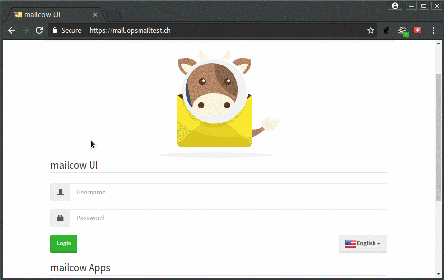
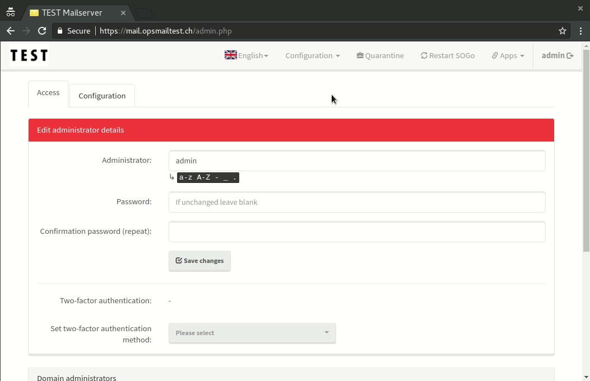
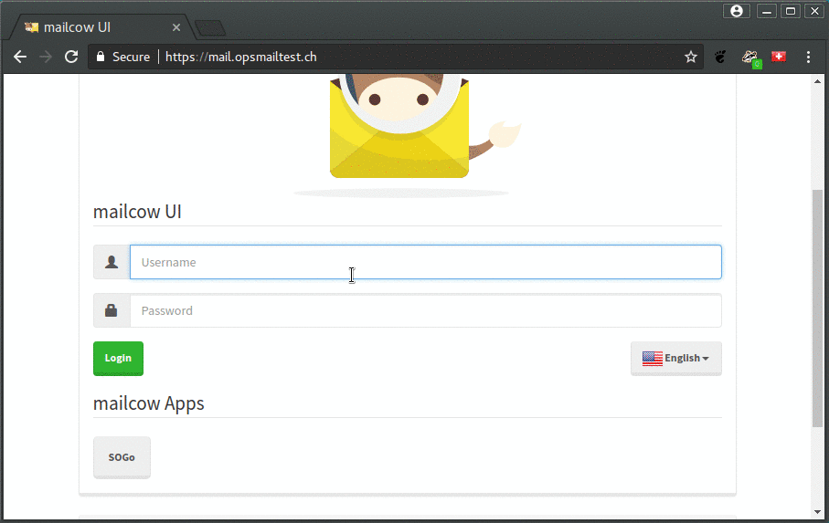
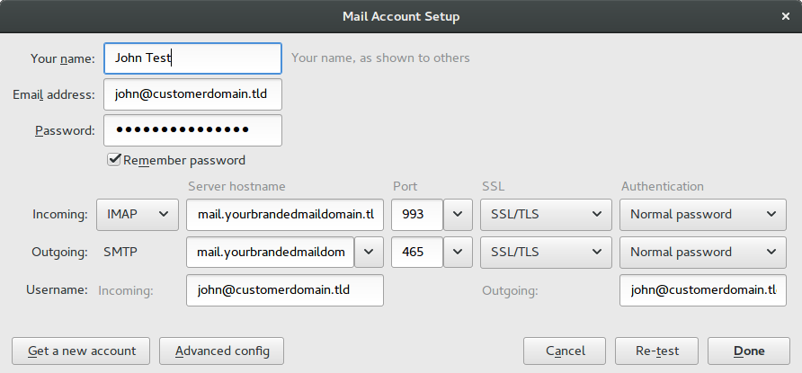
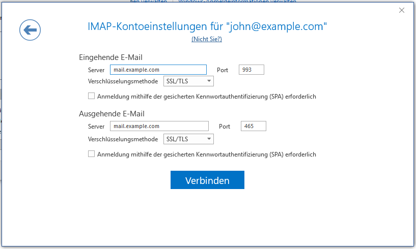

Mailserver
==========

We offer mailservers based on Postfix, Dovecot, rspamd and SOGo Groupware. Each server is dedicated to a certain customer,
therefore you can add any number of domains and accounts limited only by the ressources available (CPU/RAM/Diskspace).

.. note:: We recommend that you use a dedicated domain for your mailserver installation (e.g. opsmail.ch)

Migration
---------

Necessary steps for a mail server migration:

1. Change the TTL of the existing MX record to 5 minutes or less.
2. `Create all new mailboxes. <#add-mailbox>`__
3. `Change MX record to new one. <#dns>`__
4. Migrate your emails manually with IMAP or with a `Sync Job <#sync-jobs>`__.

.. note:: Depending on how high the old TTL entry was, we recommend waiting one day between steps one and three.

.. warning:: Local delivery: E-mails from the mail server to another domain, which are also created on the same mail server, are delivered locally. Even if the mail server is not yet in use by the recipient.

WebUI
-----

Administrator Access
~~~~~~~~~~~~~~~~~~~~

There is an administrator user (username: admin) which can be used under mail.example.com.

.. note:: The administrator password must not be changed.

Add Domain
~~~~~~~~~~

1. navigate to ``Configuration (top right) -> Mailboxes -> Add domain`` and fill in your domain name
2. add the new domain with ``Add domain and restart SOGo``

Add Mailbox
~~~~~~~~~~~

1. navigate to ``Configuration (top right) -> Mailboxes -> Mailboxes (tab) -> Add mailbox`` and fill in your desired Username, Full name and Password
2. save your settings with the ``Add``-Button

The new user can now...

* login to webmail on webmail.example.com (SOGo with integerated calendar and addressbook)
* login to mail.example.com to adjust certain settings (Spam filter, Sync jobs)
* access his mails in a mailclient like thunderbird or outlook with `IMAP/SMTP or ActiveSync <#client-configuration>`__.

Sync Jobs
~~~~~~~~~

You can import your old email with a Sync Job.

1. Navigate to ``Configuration (top right) -> Mailboxes -> Mailboxes (tab) -> Sync Jobs``
2. Create a new sync job with your settings
3. A sync job remains until you delete it. Remember to delete the sync job if you no longer need it.

DNS
---

Minimal DNS configuration
~~~~~~~~~~~~~~~~~~~~~~~~~

::

    # Name                Type        Value
    @                     IN MX 10    mail.example.com
    @                     IN TXT      v=spf1 mx -all

.. note:: Good secured mail services will discard mails sent from hosts which are not particularly allowed to, eventhough the default behaviour is to accept every mail. To explicitly allow our mailserver to send mails from your domain you need to add an SPF record to your DNS zone

.. warning:: Please make sure to include all other servers that should be able to send mails from your domain.

SRV Records
~~~~~~~~~~~

Some e-mail clients can use SRV records to automatically detect settings.

::

    # Name              Type       Value
    _imap._tcp          IN SRV     0 1 143   mail.example.org.
    _imaps._tcp         IN SRV     0 1 993   mail.example.org.
    _submission._tcp    IN SRV     0 1 587   mail.example.org.
    _smtps._tcp         IN SRV     0 1 465   mail.example.org.
    _autodiscover._tcp  IN SRV     0 1 443   mail.example.org.
    _carddavs._tcp      IN SRV     0 1 443   mail.example.org.
    _carddavs._tcp      IN TXT     "path=/SOGo/dav/"
    _caldavs._tcp       IN SRV     0 1 443   mail.example.org.
    _caldavs._tcp       IN TXT     "path=/SOGo/dav/"

DKIM
~~~~

DKIM is an email authentication method designed to detect email spoofing. While it is not required to add those records, we recommend to do so.

Generate a new key for this domain through the webinterface. Use the following settings:

::

    Domain: example.com
    Selector: dkim
    DKIM key length: 2048 bits

Add created public key to the `dkim._domiankey` DNS record:

::

    # Name              Type       Value
    dkim._domainkey     IN TXT     v=DKIM1; k=rsa; t=s; s=email; p=DKIM YOUROWNKEY

Client Configuration
--------------------

Our mailservers support IMAP, POP3, SMTP, ActiveSync, CalDAV, CardDAV and webmail access. You can find your webmail at webmail.example.com.

::

    # Typ           # Server hostname      # Port    # SSL       # Authentication
    IMAP            mail.example.com       993       SSL/TLS     Normal password
    POP3            mail.example.com       995       SSL/TLS     Normal password
    SMTP            mail.example.com       465       SSL/TLS     Normal password
    ActiveSync      mail.example.com       auto      auto        auto

.. note:: ActiveSync is not a complete Microsoft Exchange replacement. We recommend IMAP for most clients. ActiveSync can be useful for e.g. Android.

Mozilla Thunderbird
~~~~~~~~~~~~~~~~~~~

Microsoft Outlook
~~~~~~~~~~~~~~~~~

macOS Apple Mail
~~~~~~~~~~~~~~~~

Email, contacts and calendar can be configured automatically by installing a profile.

1. Open mail.example.com and log in with your mailbox credentials (not with your admin account)
2. Click on "Show configuration guides for email clients and smartphones" and then choose "macOS"
3. There you can download a mobileconfig profile to setup your client

Monitoring
----------

Our mailservers are monitored 24x7. We make sure that all services are up and running,
and also check email delivery to some common targets.

.. note:: For end2end monitoring, a dedicated email account on your server is required to send and receive mails

Backup
------

All data will backed up to another location once a day.

.. note:: If you need assistance with restoring emails or other data, don't hesitate to contact us

Emails
~~~~~~

Current e-mails and folders can be viewed under ``/var/lib/docker/volumes/mailcowdockerized_vmail-vol-1/_data/``.
Each email is stored in a single file and can be drag & drop as required. This also applies to all folders.

Database
~~~~~~~~

Configuration, contacts and calendars are stored within a MySQL database, which is dumped to ``/home/mailcow/backup/`` daily.

Other Options
-------------

Subaddressing
~~~~~~~~~~~~~

Email subaddressing trough the plus indicator is supported: The user `john@example.com` will also receive email for `john+newsletter@example.com`, `john+support@example.com` and so on. This option can be configured within the user settings.

1. open mail.example.com and login with your mailbox user (not as administrator)
2. set "Set handling for tagged mail" to "In Subfolder" or "In subject"

* In subfolder: a new subfolder named after the tag will be created below INBOX ("INBOX/newsletter").
* In subject: the tags name will be prepended to the mails subject, example: "[newsletter] mail subject".

Filter Rules
~~~~~~~~~~~~

Server side filter rules for your mailbox can be configured within SOGo settings:

1. open webmail.example.com an login to SOGo with your mailbox user
2. configure your filters in "Settings > E-Mail > Filter"

.. note:: Active filters must be checked with a green pick. Modifications must be saved with the save icon

Spam to Inbox
~~~~~~~~~~~~~

Spam end up in junk folder by default. We can change this behavior.

Create a filter (see `Filter Rules <#filter-rules>`__) in SOGo with the following options.

::

    For incoming messages that match all of the following rules:
    Header X-Spam-Flag contains YES

    Perform these actions:
    Flag the message with Junk
    File the message in INBOX
    Stop pricessing filter rules

Domain Administrators
~~~~~~~~~~~~~~~~~~~~~

You can create a separate domain administrator to delegate access for certain domains:

1. open mail.example.com and login as administrator
2. select `access` and scroll down
3. select `Add domain administrator`
