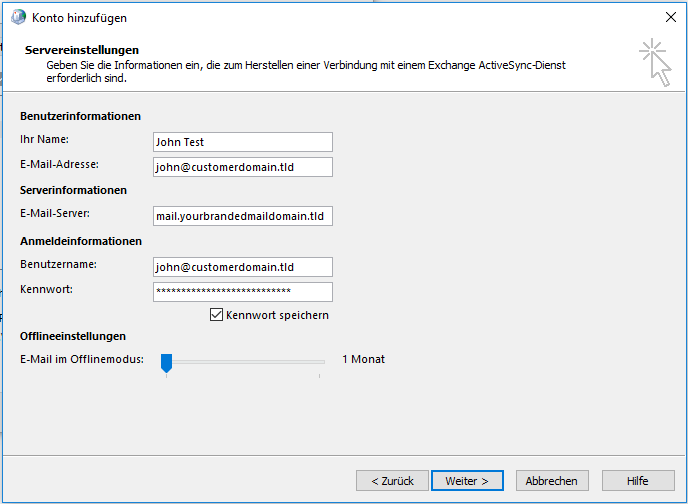
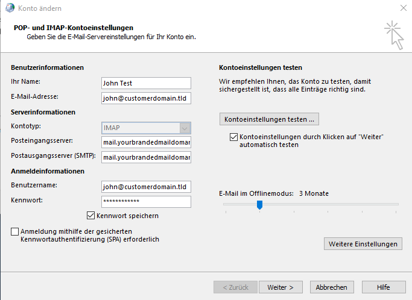
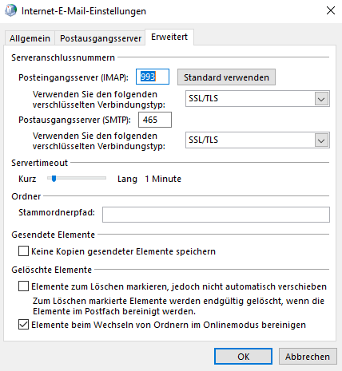

E-Mail
======

We offer a mailserver based on Postfix, Dovecot and SOGo Groupware. Our mailserver is 24x7 monitored.

Add a new customer
------------------

A new domain and mailbox can simply added with a webui. All you ned is a administrator user for mailcow and the possibility to edit your dns settings (for mx-record).

Add new domain
~~~~~~~~~~~~~~

1. open mail.yourbrandedmaildomain.tld and login to Mailcow as administrator
2. klick on ``Configuration (top right) -> Mailboxes -> Add domain`` and fill in your new domain name
3. restart SOGo after adding a new domain, klick on ``Restart SOGo`` in the upper right corner

.. image:: ../_static/create_domain.gif
   :width: 907px
   :height: 573px
   :scale: 100 %
   :alt: add new domain
   :align: left

Add new mailboxes
~~~~~~~~~~~~~~~~~

1. open mail.yourbrandedmaildomain.tld and login to Mailcow as administrator
2. klick on ``Configuration (top right) -> Mailboxes -> Mailboxes (tab) -> Add mailbox`` and fill in your desired Username, Full name and Password.

.. image:: ../_static/create_mailbox.gif
   :width: 907px
   :height: 573px
   :scale: 100 %
   :alt: add new mailbox
   :align: left

The new user can now login via webmail.yourbrandedmaildomain.tld.

DNS configuration
-----------------

The following DNS entries for your customer domain are required.

::

    # Name              Type       Value
    @                   IN MX 10   mail.yourbrandedmaildomain.tld

- The mx-record is necessary so that the server can also receive email.

The following DNS entries are highly recommended.

::

    # Name              Type       Value
    @                   IN TXT     "v=spf1 a mx ptr -all"

- Good secured mail services will discard mails sent from hosts which are not particularly allowed to, eventhough the default behaviour is to accept every mail. To explicitly allow our mailserver to send mails from your domain you need to add an SPF record to your DNS zone. Please make sure to include all other servers that should be able to send mails from your domain

The following DNS entries are recommended.

::

    # Name              Type       Value
    dkim._domainkey     IN TXT     "v=DKIM1; k=rsa; t=s; s=email; p=DKIM key"

DKIM is an email authentication method designed to detect email spoofing. You can generate a public key in the web interface from mailcow. Use the following settings.

::

    Domain: customerdomain.tld
    Selector: dkim
    DKIM key length: 2048 bits

.. image:: ../_static/create_dkim.gif
   :width: 907px
   :height: 573px
   :scale: 100 %
   :alt: create dkim key
   :align: left

Client configuration
--------------------

Our mailservice support IMAP, POP3, SMTP and ActiveSync and has also a Webmail.

::

    # Typ           # Server hostname                 # Port    # SSL       # Authentication
    IMAP            mail.yourbrandedmaildomain.tld    993       SSL/TLS     Normal password
    POP3            mail.yourbrandedmaildomain.tld    995       SSL/TLS     Normal password
    SMTP            mail.yourbrandedmaildomain.tld    465       SSL/TLS     Normal password
    ActiveSync      mail.yourbrandedmaildomain.tld    auto      auto        auto

Webmail: webmail.yourbrandedmaildomain.tld

Thunderbird
~~~~~~~~~~~

For Mozilla Thunderbird use the following configuration.

.. image:: ../_static/thunderbird_configuration.png
   :width: 892px
   :height: 415px
   :scale: 100 %
   :alt: mozilla thunderbird configuration
   :align: left

Microsoft Outlook
~~~~~~~~~~~~~~~~~

We support ActiveSync for synchronization of email, calendar and contacts. Please add the e-mail account via "Control Panel > User Accounts and Parental Controls > E-mail".

or for IMAP:

.. image:: ../_static/outlook_imap_configuration02.png
   :width: 429px
   :height: 464px
   :scale: 75 %
   :alt: outlook configuration
   :align: left

Other options
-------------

Subaddressing
~~~~~~~~~~~~~

Mialcow support email tagging trough a plus indicator. The user `john@customerdomain.tld` will also receiver email for `john+facebook@customerdomain.tld` or `john+support@customerdomain.tld` or so on. Thins option can be configured in the Mailcow user-settings.

1. open mail.yourbrandedmaildomain.tld and login to mailcow with your mailbox user (not as administrator)
2. her you can set "Set handling for tagged mail" to "In Subfolder" or "In subject"

* In subfolder: a new subfolder named after the tag will be created below INBOX ("INBOX/facebook").
* In subject: the tags name will be prepended to the mails subject, example: "[facebook] mail subject".

Filter rules
~~~~~~~~~~~~

Server side filter rules for your mailbox can found in the SOGo settings.

1. open webmail.yourbrandedmaildomain.tld an login to SOGo with your mailbox user
2. klick the sittings-ico to the right of your name
3. configure your filter under "E-Mail > Filter"

Please note: Active filter must be checked with a green pick. Also save your settings with the save-icon top right.
