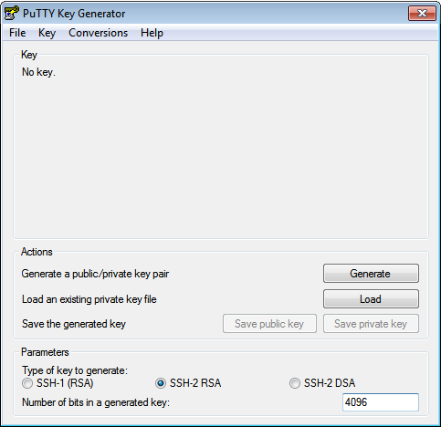
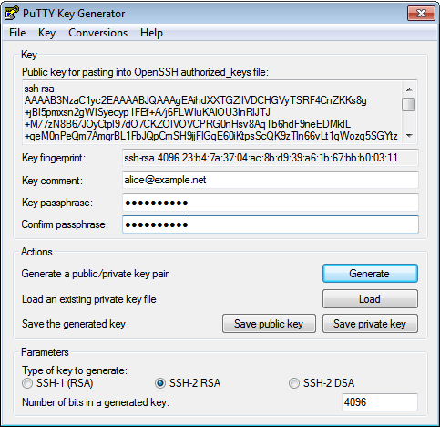

SSH Keys
========

Windows
-------

Download and install the Putty Installer from the official `download
page <http://www.chiark.greenend.org.uk/~sgtatham/putty/download.html>`__
(chiark.greenend.org.uk).

Create an SSH key pair
~~~~~~~~~~~~~~~~~~~~~~

Start puttygen, increase the ``Number of bits in a generated key`` field
to 4096 and press the Generate button:

Follow the instructions and generate randomness by moving the mouse on
the requested area.

When the key is generated, change the ``Key comment`` to your e-mail
address and enter a secure ``Key passphrase``. Press the
``Save public key`` and ``Save private key`` button and copy the text in
the upmost field:

Note: Please use your real email address

Submit public key
~~~~~~~~~~~~~~~~~

Paste the content of the field
``Public key for pasting into OpenSSH authorized_keys file`` in an
e-mail to us and add a note on which server it should
get added, for example:

::

    Add this key to example01.snowflakehosting.ch

    ssh-rsa
    AAAAB3NzaC1yc2EAAAABJQAAAgEAihdXXTGZiIVDCHGVyTSRF4CnZKKs8g+jBI5pmxsn2gWISyecyp1FEf+A/j6FLWIuKAIOU3InRlJTJ+M/7zN8B6/JOyCtpl97dO7CKZOIVOVCPRG0nHsv8AqTb6hdF9neEDMklL+qeM0nPeQm7AmqrBL1FbJQpCmSH9jjFIGqE60iKtpsScQK9zTln66vLt1gWozg5SGYtzNYDYW0clHcy54XnHdcbKwlD0aAyi+ThfF+JKjbYE0JT+iABDB7K+lxAkOwAzWbjFaan6yBj6K9sL/zOaaeHdPgSEMkk3MXZNUfjhHKeFy3p/u3UoK1FigvxSUkgh9cuXHajOfgsRhp1wXGVw4yJ3W0gp3sziZ67WYuTtCxkiQCKA0frjrP4mb2M+3xKUFBbttbz+NQcvr+VQ71zjYQqL/mbN/wP19fpAisIPsKq1XHGpt0RVcsCu2ILt8U+GZoVb5ZoLFECcmH43H3FT4TyADZCCLSKtZfJyrqyulxdy79N9Qohp//PcbVq71654g/Yj2lwDj0VKF/Eh8lLt+nUlH5y9dJIiFXjiCylC74/QAQEEfX+k2Yt/bjEKklagZ0OdhjMUe2yVb80VI9eZrpjnk03922a1EYyeCZpTkKSqq05ZFGXS+7X57PDImGz66xsR7JuVOJ+J0Wr+zmeaOEFzG5yHskgNncnSk=
    alice@example.net

.. warning:: Never send your private key to anyone, we will request a completely new key if you send us your private key

SSH Agent (Pageant)
~~~~~~~~~~~~~~~~~~~

Putty comes with a SSH agent named pageant. It comes bundled with the
putty installer or you can find it on the putty download page. After you
started Pageant, it will hide itselve in the systray. To add your key,
open the Pageant dialog by right clicking on the systray icon. Please
refere to the `Pageant
documentation <http://the.earth.li/~sgtatham/putty/0.58/htmldoc/Chapter9.html#pageant>`__
for more information.

Agent Forwarding
~~~~~~~~~~~~~~~~

WARNING: "Agent forwarding should be enabled with caution. Users with
the ability to bypass file permissions on the remote host (for the
agent's UNIX-domain socket) can access the local agent through the
forwarded connection. An attacker cannot obtain key material from the
agent, however they can perform operations on the keys that enable them
to authenticate using the identities loaded into the agent." (openssh
manual)

For several actions like checking out a git repository or copying a site
form stage to prod you need to forward your SSH Agent. First you have to
browse to ``Connection->SSH->Auth`` on the left-hand side, then you have
to enable the ``Allow agent forwarding`` checkbox:

.. figure:: putty-allow-agent-forwarding.png

Afterwards you go back to Session and ``Save`` the ``Default Settings``:

.. figure:: putty-save-agent-forwarding.png

Mac, Linux
----------

Create an SSH key pair
~~~~~~~~~~~~~~~~~~~~~~

If you have access to a SHELL and openssh (Mac/Linux) use the following
command to create a new SSH key pair:

::

    $ ssh-keygen -t ed25519 -a 100 -C '<e-mail@address>'

.. hint:: do not create keys without passphrase. If you do, everyone with access to the key file will gain access to the server immediatelly.

Agent Forwarding
~~~~~~~~~~~~~~~~

For several actions like checking out a git repository or copying a site
form stage to prod you need to forward your SSH Agent. Use the command
``ssh -F`` or the SSH config directive ``ForwardAgent yes`` to forward
your SSH Agent.

SSH agent
~~~~~~~~~

Since you encrypted your key with a secure passphrase, you have to enter
this passphrase every time you attempt to connect to an SSH Server in
order to decrypt your private key.

An SSH agent caches your decrypted keys and provides them to SSH client
programs. Thus the passphrase must only provided once, when adding your
private key to the agent's cache.

Hint: Usually you would start your agent upon login, and let it run
until you logout. There are many diffrent agents, and they are typically
well integrated to your OS, SHELL or Desktop Environment. Please refer
to the documentation of your favorite agent.

This command starts ssh-agent, the SSH agent of openssh, and exports the
SSH\_AUTH\_SOCK and SSH\_AGENT\_PID variables:

::

    $ eval $(ssh-agent)

Then you need to add your private key to the ssh-agent cache:

::

    $ssh-add -c <keyfile>

You can now connect to any SSH server without typing your passphrase.
You can check for a running SSH agent with the command
``echo $SSH_AUTH_SOCK``.

Warning: Please use the -c flag to prevent key hijacking. This flag
''indicates that added identities should be subject to confirmation
before being used for authentication''. That means, you have to confirm
all uses of your key, espessially when you are logged in to a server
(with enabled AgentForwarding) and another user tries to steal your
identity. Please refere to the documentation of your favorite agent on
how to prevent key hijacking.

Confirmation is performed by the SSH\_ASKPASS program mentioned below.
Successful confirmation is signaled by a zero exit status from the
SSH\_ASKPASS program, rather than text entered into the requester.

Update passphrase without generating a new key
~~~~~~~~~~~~~~~~~~~~~~~~~~~~~~~~~~~~~~~~~~~~~~

::

    $ ssh-keygen -f <keyfile> -p
